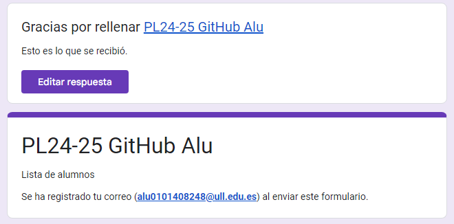
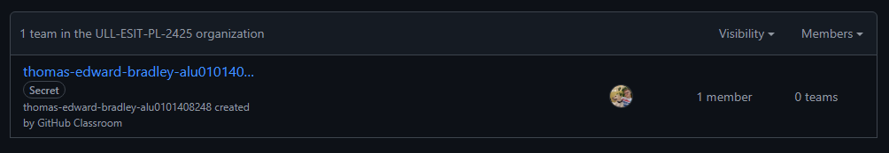
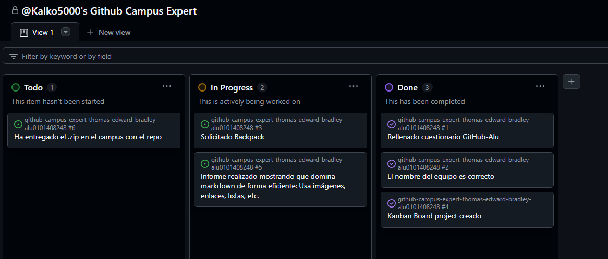
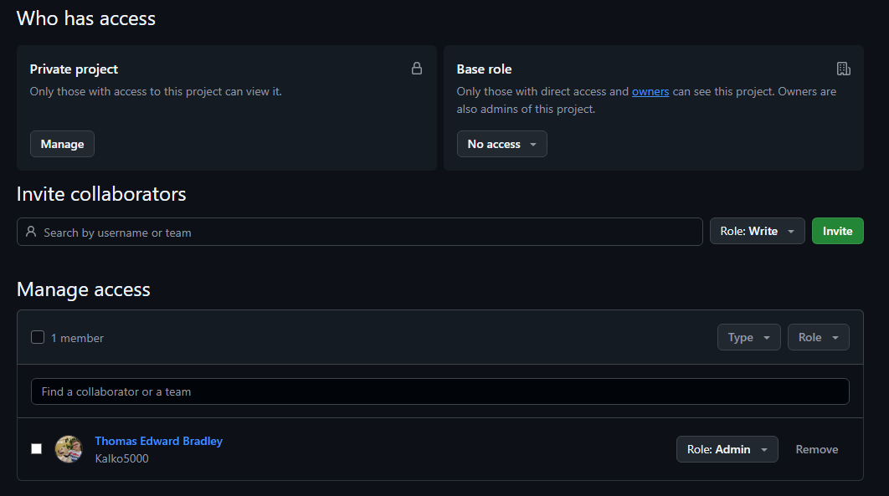
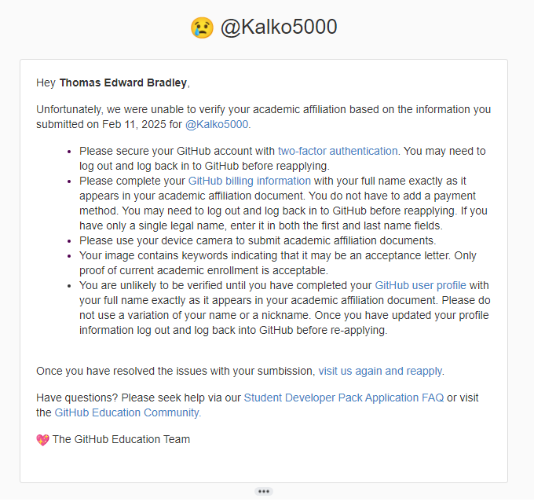

# Github Campus Expert 

- Thomas Edward 
- Bradley 
- alu0101408248

## Rellenar el cuestionario GitHub-Alu del campus virtual y recibir el correo confirmándolo

## Crear equipo con nombre correcto

## Crear un project board kanban para este repositorio

  
  

## Solicitar el GitHub Backpack

Trate de solicitar Github Education pero mi tarjeta física de la ULL esta fuera de fecha, no pude sacar foto de la tarjeta digital y Github no me aceptaba recibos / pruebas de matricula.  
  

